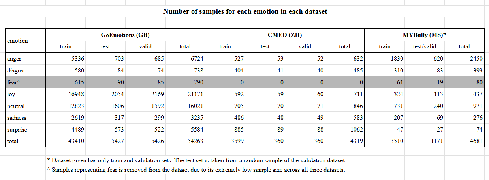

## Week 1 (20260921 - 20260927)

Having no previous experience with NLP or PyTorch, much of this week was simply documentation-reading to get a brief view.
I chose to use XLM-RoBERTa-base as my tokenizer by virtue of its multilingual tokenising capability.

### Malay databases

I installed `melayu_ternate.csv` ([Link](https://www.kaggle.com/datasets/bangsate/emosi-melayu-ternate)) and ran a quick classification with XLM-RoBERTa.
I later found this dataset not a good fit for the purposes of this research as this dataset concerns Indonesian and Ternate Malay.

The results are rather disappointing: an accuracy of 0.4214, with the confusion matrix indicating that only three of the ten emotions were learnt.
The cause is believed to be the low sample size of certain emotions.

I believe EmoTweet-Malay-6 would have been useful, but it is not open-sourced.
If we truly find this beneficial, it might be worth reaching out to them.

I also found `emotion-twitter-lexicon.js` ([Link](https://github.com/rozabond/malay-dataset/tree/master/corpus/emotion)), but the dataset is too large for the purpose of this research.


### English databases (GoEmotions)

Initial attempts to train models using GoEmotions yield an accuracy of about 0.45.
This is due to the multi-label nature of its samples.
Using the Ekman mapping, I have classified the 27 emotions from GoEmotions into 7 main categories (+ neutral).
Training the single-label model shoots the accuracy up to 0.68.

The following table shows the number of samples for each emotion.
| emotion | train | test | valid | total |
| :--- | :---: | :---: | :---: | :---: |
| **joy** | 16948 | 2054 | 2169 | 21171 |
| **neutral** | 12823 | 1606 | 1592 | 16021 |
| **anger** | 5336 | 703 | 685 | 6724 |
| **surprise** | 4489 | 573 | 522 | 5584 |
| **sadness** | 2619 | 317 | 299 | 3235 |
| **fear** | 615 | 90 | 85 | 790 |
| **disgust** | 580 | 84 | 74 | 738 |
| **total** | **43410** | **5427** | **5426** |

Beyond this point, modifying the learning rate, batch size, or number of epoch cause little to no effect, and the model seems to overfit beyond Epoch 3.

```
Evaluation of base model
Accuracy:     0.6792
Macro-F1:     0.6032
Weighted-F1:  0.6743
```


## Week 2 (20260928 - 20261003)

### Focal loss

Due to the disproportionate class sizes of the dataset, I was advised to implement focal loss.
Indeed, this was helpful in training smaller categories (eg. disgust, fear), with the trade-off of a similar decrement in accuracy for larger categories.

As this research will pivot towards meta-learning, I believe it is beneficial to keep each category accurate to some degree rather than performing particularly well in certain categories and horrible in others.
Therefore, the focal loss function is kept in the model.

```
Evaluation of model with focal loss
Accuracy:     0.6178
Macro-F1:     0.5442
Weighted-F1:  0.6212
```

```
Category Confusion Matrix (without focal loss)
          anger  disgust  fear   joy  sadness  surprise  neutral
anger       396       19     6    71       31        39      141
disgust      23       37     3     8        4         4        5
fear          7        3    59     3        8         3        7
joy          47        3    11  1787       16        36      154
sadness      30        3     3    39      168        24       50
surprise     31        3     4    93       21       336       85
neutral     181        8     7   306       44       157      903
```

```
Category Confusion Matrix (with focal loss)

          anger  disgust  fear   joy  sadness  surprise  neutral
anger       421       62    18    45       50        48       59
disgust      10       60     6     3        2         3        0
fear          4        5    70     0       10         0        1
joy         117       13    35  1557       76       102      154
sadness      37       16    14    15      200        17       18
surprise     35       10     7    43       23       407       48
neutral     311       42    45   230      104       236      638
```

### Datasets

More datasets are needed to commence meta-learning.
I took [Chinese Multi-Emotion Dataset](https://huggingface.co/datasets/Johnson8187/Chinese_Multi-Emotion_Dialogue_Dataset) (Chinese) and [MYBully](https://huggingface.co/datasets/mohanrj/MYBully) (Malay) as the datasets here to evaluate the baseline model trained from these datasets.
These models conveniently also use the Ekman labels.



#### MYBully

The publisher themselves obtained an accuracy of 0.66, but I couldn't get it past 0.52.
The confusion matrix suggests that the model performs extremely poorly on categories of smaller class size.

```
Category Confusion Matrix (MYBully)

           Anger  Disgust  Fear  Happiness  Neutral  Sadness  Surprise
Anger        393       71    29         17       32       43        35
Disgust       29       31     4          5        4        7         3
Fear           3        5     4          0        0        6         1
Happiness      7        8     3         51        8       14        22
Neutral       51       27    16         23       81       23        19
Sadness        9        3     7          1        1       45         3
Surprise       3        4     1          7        0        7         5
```

#### Chinese Multi-Emotion Dialogue Dataset (CMED)

This dataset unfortunately does not have any samples for fear.
This motivated me to remove this label in other sets during meta-learning later on, as its sample size is generally too low.

As the categories are more balanced, I was able to get an accuracy of 0.89 first try.
The confusion matrix also suggests most samples are categorised correctly, with mistakes few and far between.

```
Accuracy:     0.8889
Macro-F1:     0.8880
Weighted-F1:  0.8889
```

```
Category Confusion Matrix (CMED)
          Anger  Disgust  Joy  Neutral  Sadness  Surprise
Anger        45        6    0        0        0         2
Disgust       3       36    0        2        0         0
Joy           0        0   57        0        0         2
Neutral       0        2    1       64        1         2
Sadness       0        1    0        2       42         3
Surprise      1        0    6        5        1        76
```


### Meta-learning

Unfortunately not completed during this week due to technical difficulties.

## Week 3 (20261004 - 20261010)

### Balanced accuracy

Balanced accuracy is believed to be a better metric to analyse performance compared to existing metrics due to the imbalanced nature of the classes in the datasets.

The results are as follows (not the same model as the data before):

|  dataset   | accuracy | balanced accuracy | macro-F1 | weighted F1 |
|------------|----------|-------------------|----------|-------------|
|   mybully  |   0.4979 |            0.4040 |   0.3467 |  **0.5373** |
|    cmed    |   0.8944 |        **0.8983** |   0.8948 |      0.8945 |
| goemotions |   0.6051 |        **0.6562** |   0.5310 |      0.6089 |

From the table above, balanced accuracy seems to yield higher values for already robust datasets.
This metric is kept for future references.

### Meta-learning

Finally entering the main topic.

I had an initial run of a 5-way, 2-shot, 3-query, 40-episode, 5-epoch model that accidentally included the MYBully dataset in training.
The results were unsatisfactory (~0.27 accuracy), with a hypothesised cause of low episode count.

Fixing the conceptual errors, I modified the parameters such that the model now runs 6-way, 5-shot, 5-query, 
The results were positive during training, demonstrating a stable growth with a peak at a validation accuracy of 0.7660.
```
Epoch 8/10 | train loss 1.1222, train episode accuracy 0.8556 | validation loss 1.2044, validation episode accuracy 0.7660
```

However, the MYBully held-out episode results remain unsatisfactory.
Precision for all classes remain below 0.5, and the confusion matrix suggests a very noisy prediction.
The hypothesis of low episode count is thought to still apply here, as the model was only given 200 episodes to adapt to the MYBully dataset.

```
Accuracy:    0.3588
Balanced accuracy: 0.3588
Macro-F1:    0.3444
```